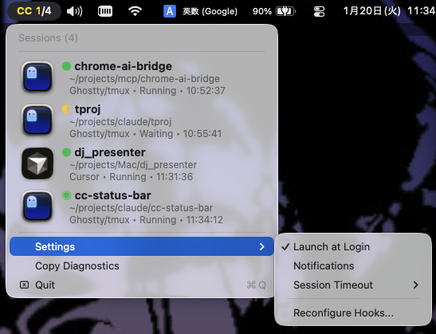

# CC Status Bar

A native macOS menu bar app for real-time monitoring of Claude Code sessions.



## Features

### Menu Bar Display
- **🟢 Green** = Sessions running
- **🔴 Red** = Permission prompt waiting (highest priority)
- **🟡 Yellow** = Command completion waiting
- **⚪ White** = Idle (no active sessions)

### Session List
Click the menu to see session details:
```
● cc-status-bar
   ~/projects/claude/cc-status-bar • Running • 5s ago
```

Access the submenu for quick actions:
- **Open in Finder** - Open the project directory
- **Copy Path/TTY** - Copy to clipboard

### Global Hotkey
Enable **⌘⇧C** (Cmd+Shift+C) in Settings to quickly focus waiting sessions without using the menu bar.

When triggered:
1. Focuses the highest priority waiting session (red > yellow)
2. If no waiting sessions, focuses the most recent session
3. If no sessions, opens the menu

### Notification Actions
When a session needs attention, notifications include a **Focus Terminal** button for instant access.

### Auto Setup
On first launch, the app automatically:
- Creates symlink for Claude Code hooks
- Registers hooks in `~/.claude/settings.json`
- Creates backup of existing settings

## Supported Environments

### Fully Supported
| Environment | Features |
|-------------|----------|
| **Ghostty + tmux** | Full tab switching and pane focus |
| **iTerm2** | Full tab switching by TTY (with or without tmux) |
| **VS Code / Cursor / Windsurf** | Window focus by project name matching |

### VS Code and Similar Editors

CC Status Bar supports VS Code, Cursor, Windsurf, VSCodium, Positron, Trae, and Zed.

**Important:** The VS Code Claude extension's Native UI (sidebar chat) does not support hooks - CCStatusBar cannot detect these sessions.

**Setup for VS Code Claude Extension:**

Enable Terminal Mode in VS Code settings:
```json
// settings.json
{
  "claudeCode.useTerminal": true
}
```

Or run `claude` directly in VS Code's integrated terminal.

**How it works:**
1. Claude Code runs in Terminal Mode (or integrated terminal)
2. CC Status Bar detects the editor via PPID chain inspection
3. Session displays with the editor name (e.g., "VS Code", "Cursor")
4. Clicking the session focuses the correct editor window

### Ghostty without tmux
CC Status Bar uses OSC escape sequences to set unique tab titles for reliable identification.

**Automatic Handling:**
1. When focusing a session, the app sets a unique title tag `[CCSB:ttysNNN]`
2. This works even if Claude Code overwrites the title
3. If auto-detection fails, you'll be prompted to bind the current tab manually

**Optional:** For best results, disable Claude Code's title override:
```json
// ~/.claude/settings.json
{
  "env": {
    "CLAUDE_CODE_DISABLE_TERMINAL_TITLE": "1"
  }
}
```

### Partially Supported
| Environment | Features |
|-------------|----------|
| **Terminal.app + tmux** | Pane focus only |

### Not Supported
- Warp (limited external tab control API)
- Non-tmux environments with multiple tabs (TTY identification difficult)

## Requirements

- macOS 13.0+
- Claude Code CLI
- Accessibility permission (for Ghostty tab switching)

## Installation

### From Release

1. Download `CCStatusBar.dmg` from [Releases](../../releases)
2. Open DMG and drag `CCStatusBar.app` to Applications
3. Launch from Applications
4. Grant Accessibility permission when prompted
5. Follow the setup wizard

> **Note**: The app is notarized by Apple, so it opens without Gatekeeper warnings.

### From Source
```bash
# Build
swift build

# Copy to .app bundle
cp .build/debug/CCStatusBar CCStatusBar.app/Contents/MacOS/

# Code sign (ad-hoc)
codesign --force --deep --sign - CCStatusBar.app

# Launch
open CCStatusBar.app
```

### Stream Deck Plugin (Optional)

If you have an Elgato Stream Deck, install the included plugin:

1. Double-click `CC Status Bar.streamDeckPlugin` in the DMG
2. Stream Deck app will open and install the plugin automatically

**Available Actions:**
| Action | Function |
|--------|----------|
| Session | Display and focus Claude Code sessions |
| Up/Down Arrow | Send arrow keys (for prompt selection) |
| Enter | Send Enter key |
| Escape | Send Escape key |
| Dictation | Toggle macOS dictation |

## Permissions

- **Accessibility**: Required for terminal tab switching (Ghostty)
  - System Settings → Privacy & Security → Accessibility → CCStatusBar ✓

### Quick Access
Open Settings → Permissions to view:
- Current permission status
- "Open Accessibility Settings..."

## How It Works

The app uses Claude Code hooks to track session status:

1. **Hooks** are registered in `~/.claude/settings.json`
2. **Events** (Notification, Stop, UserPromptSubmit) trigger status updates
3. **Sessions** are stored in `~/Library/Application Support/CCStatusBar/sessions.json`
4. **Menu bar** updates in real-time via file watching

### Session Status
| Status | Description |
|--------|-------------|
| Running | Claude Code is executing tools |
| Waiting | Waiting for permission prompt |
| Stopped | Session ended |

## CLI Commands

```bash
# Manual setup (usually not needed)
CCStatusBar setup

# Force reconfigure
CCStatusBar setup --force

# Uninstall (remove hooks and data)
CCStatusBar setup --uninstall

# List active sessions
CCStatusBar list

# Emit CCSB protocol event (for external tools)
CCStatusBar emit --tool aider --event session.start --session-id abc123
```

## CCSB Events Protocol

CC Status Bar supports a standardized event protocol for integration with external CLI tools.

### Event Types

| Event | Description |
|-------|-------------|
| `session.start` | Session started |
| `session.stop` | Session ended |
| `session.waiting` | Waiting for user input |
| `session.running` | Running/executing |
| `artifact.link` | Link to artifact (file, URL, PR) |

### Attention Levels

| Level | Color | Description |
|-------|-------|-------------|
| `green` | 🟢 | Running, no action needed |
| `yellow` | 🟡 | Waiting for input |
| `red` | 🔴 | Error or critical |
| `none` | ⚪ | Stopped |

### CLI Usage

```bash
# Start a session
CCStatusBar emit --tool aider --event session.start --session-id my-session-001

# Mark as waiting
CCStatusBar emit --tool terraform --event session.waiting --session-id tf-plan-001 \
  --summary "Waiting for plan approval"

# Stop a session
CCStatusBar emit --tool aider --event session.stop --session-id my-session-001
```

### JSON Format

```json
{
  "proto": "ccsb.v1",
  "event": "session.waiting",
  "session_id": "unique-id",
  "timestamp": "2026-01-19T12:00:00Z",
  "tool": {
    "name": "aider",
    "version": "0.50.0"
  },
  "cwd": "/path/to/project",
  "tty": "/dev/ttys001",
  "attention": {
    "level": "yellow",
    "reason": "Waiting for user input"
  },
  "summary": "Waiting for input"
}
```

Pipe JSON directly:
```bash
echo '{"proto":"ccsb.v1",...}' | CCStatusBar emit --json
```

## Security & Privacy

### Data Collection

CC Status Bar stores the following data **locally on your machine**:

| Data | Location | Purpose |
|------|----------|---------|
| Session info | `~/Library/Application Support/CCStatusBar/sessions.json` | Track active Claude Code sessions |
| Debug logs | `~/Library/Logs/CCStatusBar/debug.log` | Troubleshooting |

**What we store:**
- Project directory paths (for display only)
- TTY identifiers (for terminal switching)
- Session timestamps

**What we DON'T store:**
- Your code or file contents
- Claude Code prompts or responses
- Any personal information

### Network Activity

CC Status Bar makes **zero network requests**. All functionality is local.

### Diagnostics Privacy

When you click "Copy Diagnostics":
- User paths are masked (`/Users/yourname/` → `~/`)
- TTY names are shortened (`/dev/ttys001` → `ttys001`)
- No settings.json content is included

### Why These Permissions?

| Permission | Reason |
|------------|--------|
| **Accessibility** | Required to identify and switch Ghostty tabs via Accessibility API |
| **Automation** | Required to send AppleScript commands to iTerm2/Terminal.app |

These permissions are only used when you click a session to focus its terminal.

## Troubleshooting

### Copy Diagnostics
Click the menu bar icon → "Copy Diagnostics" to copy diagnostic info to clipboard.

### Log File
Check `~/Library/Logs/CCStatusBar/debug.log` for detailed logs.

### App Translocation
If you see "Please move CC Status Bar" on launch:
- macOS is running the app from a temporary location
- Move the app to `/Applications` or another permanent folder
- Relaunch the app

## License

MIT
